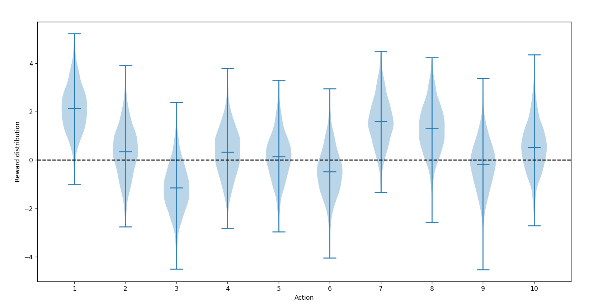
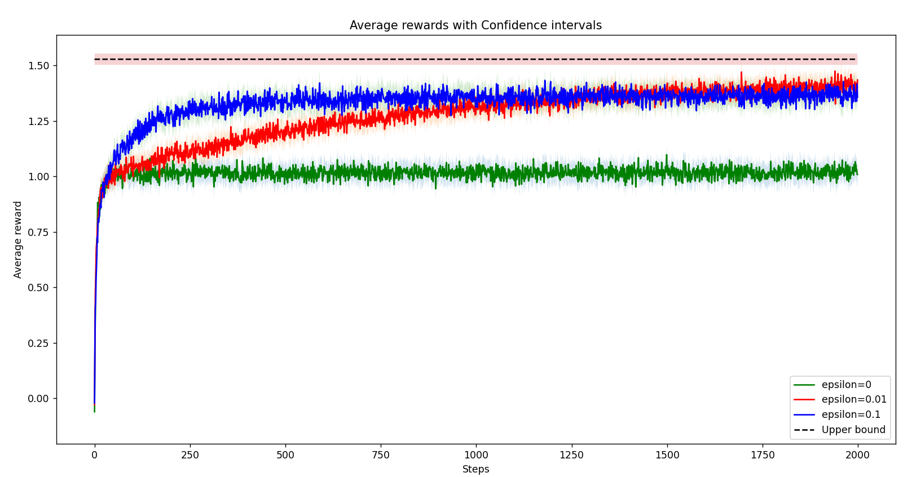
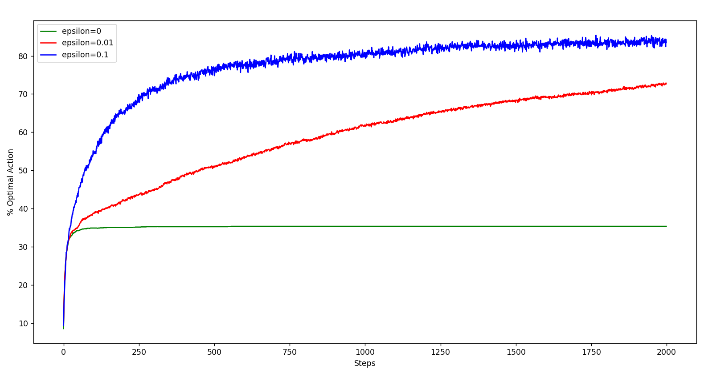
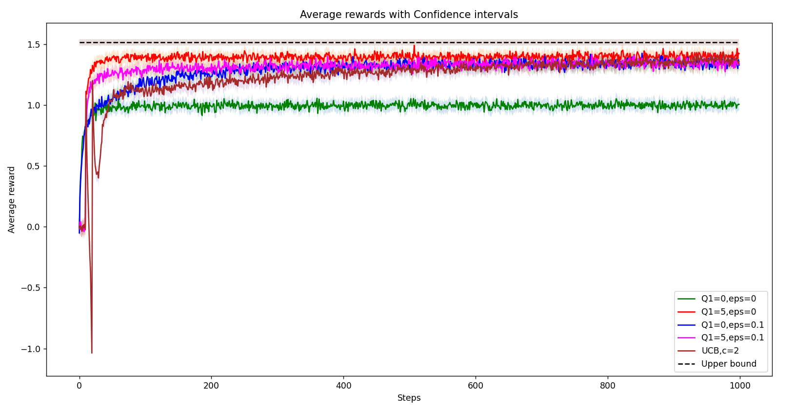
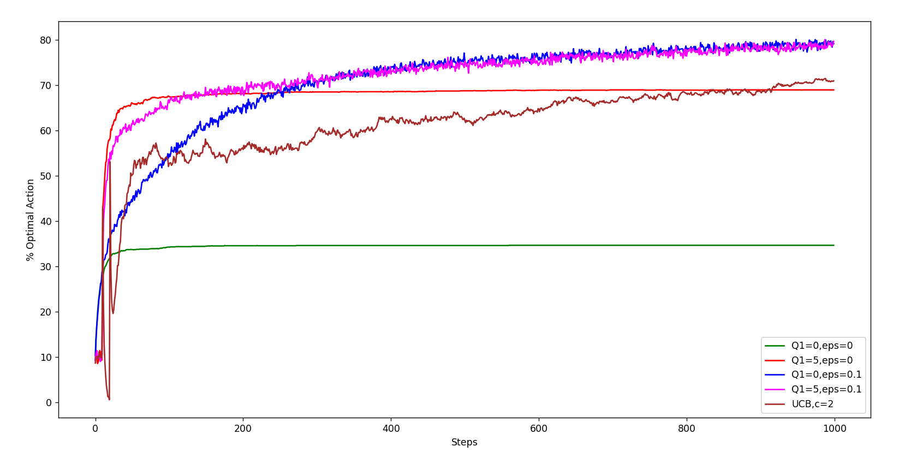

# Multi_armed_bandits

The multi-armed bandit problem was implemented using Epsilon-Greedy and Upper Confidence Bound(UCB1) Algorithm.

## Libraries used
- numpy
- matplotlib

## Description
A 10-armed testbed was generated, reproducing some textbook figures based on this testbed, and performing further experimentation on bandit algorithms. The testbed contains 2000 trials with varying steps for each part, with the true action values q∗(a) for each action/arm in each bandit sampled from a normal distribution N(0,1). When a learning algorithm is applied, action At at time t is selected and reward Rt is sampled from normal distribution of true mean and variance 1. Performance is evaluated as 'Average Reward' or '%tprimal Action picked' at each step.

## Manually implementing the 10-armed testbed
In this, the q4 function in main.py forms a Bandit testbed using the 'BanditEnv' class. Then it pulls each arm many times and generates rewards from the true means. Finally it plots a violin plot to show the distribution of sampled rewards.

## Epsilon Greedy Algorithm
Implemented the ε-greedy algorithm with incremental updates. Used 2000 steps with 2000 independent runs. The function q6 in main.py forms the Bandit environment, takes a list of agents with varying epsilon values, and calculates the average reward and the number of times optimal action was taken. In the agent.py file, the EpsilonGreedy class chooses action and then updates it. Update happens dynamically if no step size is given. For the reward plot, an extra constant upper bound line is added corresponding to the best possible average performance in the trials, based on the known true expected rewards q∗(a). 
For each reward curve, confidence bands are also plotted corresponding to (1.96× standard error) of the rewards. The standard error of the mean is defined as the standard deviation divided by √n: (σ/√n)

## Optimistic Initialization and UCB Algorithm
Implemented the ε-greedy algorithm with optimistic initial values, and the bandit algorithm with UCB action selection. Used 1000 steps with 2000 trials. In UCB, the arm to be pulled in a given bandit problem is selected using upper confidence bounds. At first, all the arms are pulled once to get an initial estimate Q(a). After this the arm pulled (a) is selected according to the following equation :

At=argmaxa [Qt(a)+c*sqrt(ln t/Nt(a))] 

Both average reward and % Optimal action curves were plotted. Both contain 5 curves:
- ε-greedy (Q1 = 0, ε = 0)
- ε-greedy (Q1 = 5, ε = 0)
- ε-greedy (Q1 = 0, ε = 0.1)
- ε-greedy (Q1 = 5, ε = 0.1)
- UCB (c = 2)

 
